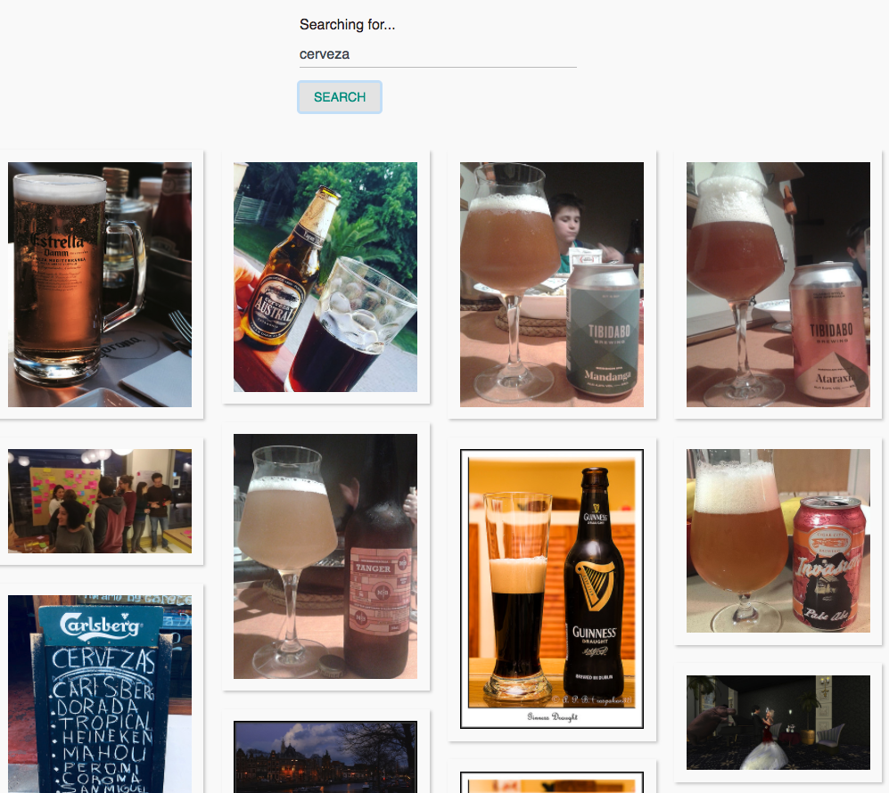

* Stateless, responsive, accessible, and highly customizable
* Maintains the original aspect ratio of your photos
* Uses actual image elements, optionally pass in srcSet and sizes attributes
* Supports passing in a custom image component for implementation of things like image selection, favorites, captions, or whatever your little heart desires!

## Demo

[https://golasowska.github.io/photo-gallery/ ](https://golasowska.github.io/photo-gallery/ )

## Preview


## Documentation and Examples

[https://golasowska.github.io/photo-gallery/ ](https://golasowska.github.io/photo-gallery/ )


To build some examples locally, run:

```
npm install
npm start
```

Then open [`localhost:3000`](http://localhost:3000) in a browser.
